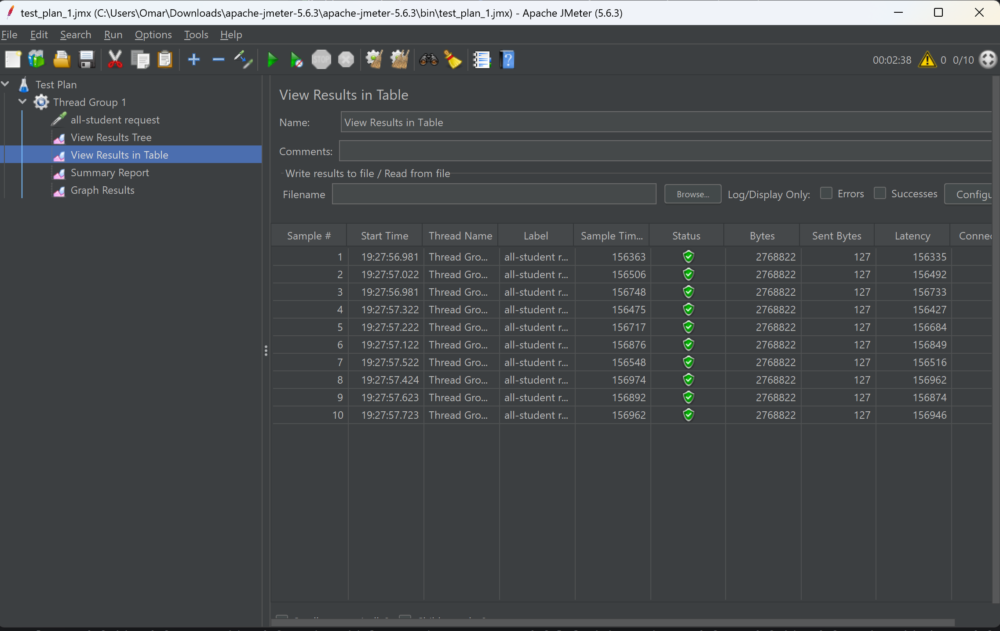
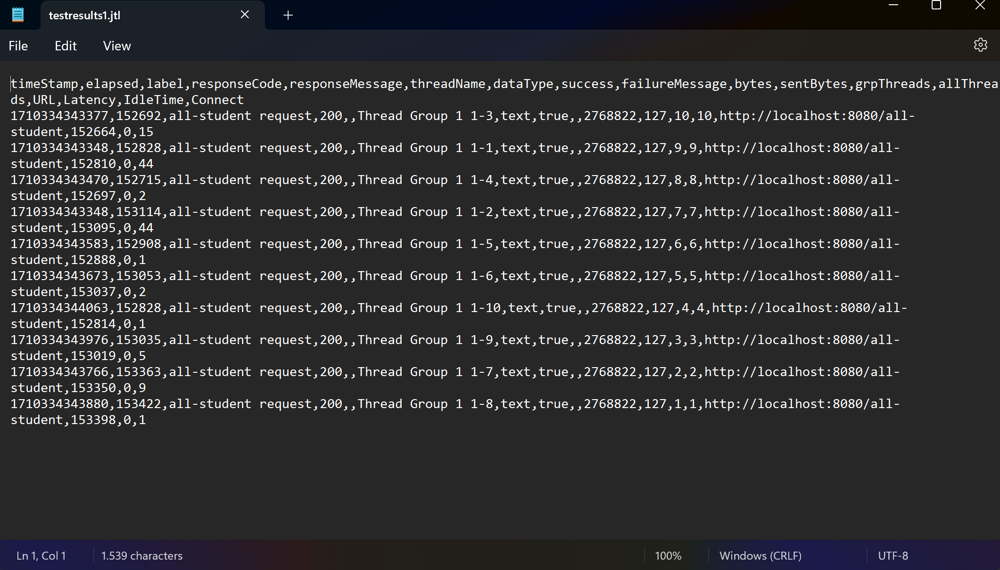
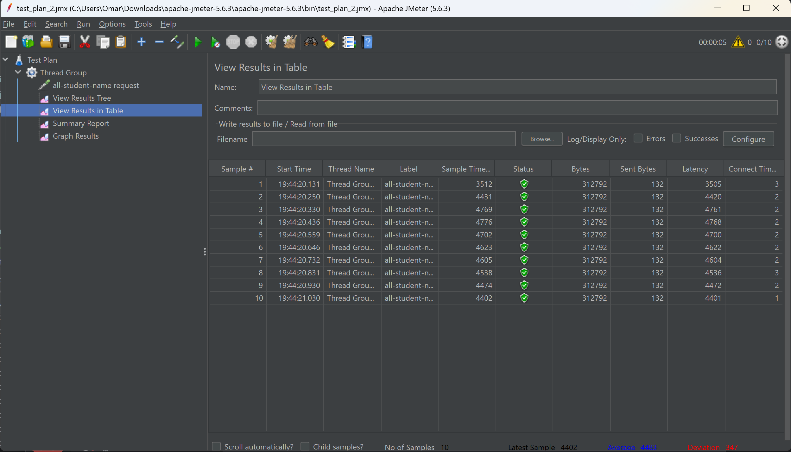
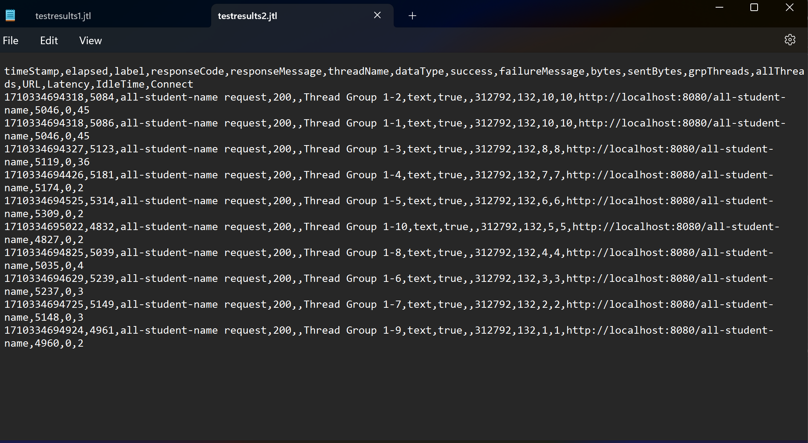
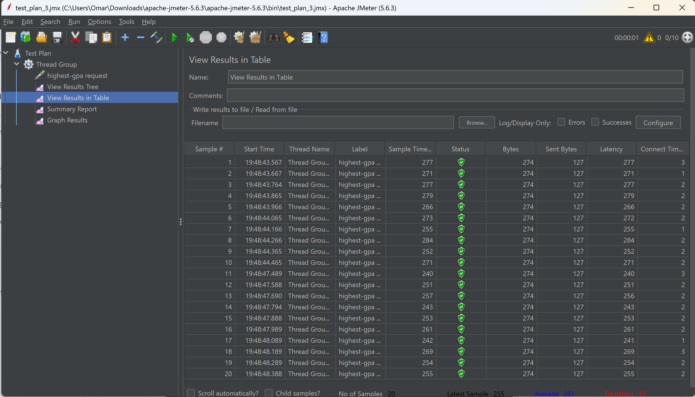
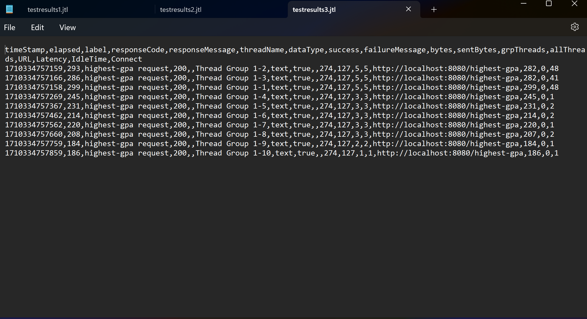

## Screenshot

### all-student

### all-student-name

### highest-gpa

## Reflection
1) Performance testing with JMeter focuses on assessing how the application performs under various load conditions. On the other hand, profiling with IntelliJ Profiler provides detailed insights into the application's runtime behavior and helps identify specific areas for optimization within the codebase. Both are valuable tools in optimizing application performance and are often used together to achieve optimal results.

2) It helps by providing a comprehensive view of the runtime behavior of the website code, helps identify performance bottlenecks, optimizes critical sections of the codebase, and improves overall website performance and scalability.

3) Yes, IntelliJ Profiler is a powerful and effective tool for analyzing and identifying bottlenecks as it optimizes the application's performance and improve its responsiveness, scalability, and resource efficiency effectively.

4) Navigating through the profiler menu is sometimes irritating as I have to go through multiple tabs and finding the method in the menu.

5) For me intelliJ Profiler helps giving me detailed information regarding the runtime behaviour.

6) First, I would try to analyze if there's a difference in the test environment as it can effect the results. And because JMeter is also affected by network latency as it checks the response time, I must check my network latency too.

7) First I must identify the bottlenecks. I have to analyze the results from performance testing and profiling to identify specific areas of the code that contribute most to performance issues. Then I can implement efficients algorithm on my code that minimize computational complexity and memory usage. After that, I must compare the performance of before and after implementing the more efficient algorithm.